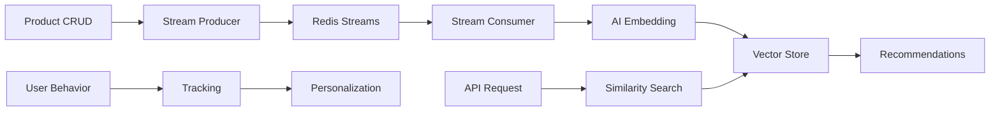

# Real-time AI Recommender - Project Objectives

## 🎯 Project Overview

The **Real-time AI Recommender** is a production-ready e-commerce recommendation engine designed to provide intelligent, real-time product recommendations with minimal latency. This project demonstrates a scalable, event-driven microservices architecture specifically tailored for modern e-commerce platforms.

## 🚀 Primary Business Objectives

### 1. **Intelligent Product Discovery**
- **Similar Product Recommendations**: Leverage vector similarity to find products similar to what users are currently viewing
- **Personalized User Experience**: Generate tailored recommendations based on individual user behavior and viewing history
- **Category-based Suggestions**: Surface popular and trending products within specific categories
- **Semantic Text Search**: Enable natural language product search with AI-powered understanding

### 2. **Real-time E-commerce Integration**
- **Dynamic Product Management**: Full CRUD operations with instant recommendation updates
- **Behavioral Analytics**: Track and analyze user interactions for continuous improvement
- **Event-driven Processing**: Immediate processing of product changes through stream architecture
- **Scalable Infrastructure**: Built for high-traffic e-commerce environments

### 3. **Business Value Creation**
- **Increased Conversion Rates**: Improve product discovery and cross-selling opportunities
- **Enhanced User Engagement**: Keep users engaged with relevant, personalized content
- **Data-driven Insights**: Provide actionable analytics on user preferences and product performance
- **Competitive Advantage**: Modern AI-powered recommendation capabilities

## 🏗️ Technical Architecture Objectives

### **Microservices-Oriented Design**
- **API Layer**: RESTful FastAPI services for product management and recommendations
- **Stream Processing**: Redis Streams for real-time event handling and data flow
- **AI/ML Services**: Modular embedding generation and similarity computation
- **Vector Storage**: High-performance Redis-based vector similarity search
- **Recommendation Engine**: Multi-strategy recommendation algorithms

### **Performance & Scalability Goals**
- **Low Latency**: Sub-100ms response times for recommendation requests
- **High Throughput**: Support for thousands of concurrent users and requests
- **Horizontal Scaling**: Architecture designed for easy scaling across multiple instances
- **Real-time Processing**: Immediate reflection of product updates in recommendations

### **Data Flow Architecture**

## 🎯 Core Use Cases

### **E-commerce Platform Integration**
1. **Product Page Recommendations**
   - Show "Similar Products" on product detail pages
   - Cross-sell complementary items during browsing

2. **Search Enhancement**
   - Improve search results with semantic understanding
   - Provide alternative suggestions for poor search results

3. **Personalized Shopping**
   - Homepage recommendations based on user history
   - Email/notification campaigns with personalized product suggestions

4. **Inventory & Business Intelligence**
   - Track product popularity and trends
   - Identify products that work well together
   - Support inventory management decisions

### **User Experience Objectives**
- **Discovery**: Help users find products they didn't know they wanted
- **Convenience**: Reduce time to find relevant products
- **Engagement**: Increase session duration and page views
- **Satisfaction**: Provide relevant, non-intrusive recommendations

## 🔧 Technical Implementation Goals

### **AI/ML Capabilities**
- **Vector Embeddings**: TF-IDF-based text-to-vector conversion (384 dimensions)
- **Similarity Search**: Cosine similarity with configurable thresholds
- **Approximate Nearest Neighbors**: HNSW algorithm for fast vector search
- **Real-time Learning**: Immediate incorporation of new products and user behavior

### **Data Processing Pipeline**
1. **Product Events**: Create, Update, Delete operations trigger stream events
2. **Embedding Generation**: Real-time conversion of product data to vectors
3. **Vector Storage**: Efficient storage and indexing in Redis
4. **Similarity Computation**: Fast retrieval of similar products
5. **Recommendation Delivery**: Low-latency API responses

### **System Reliability & Monitoring**
- **Error Handling**: Comprehensive exception handling and graceful degradation
- **Logging**: Structured logging with Loguru for debugging and monitoring
- **Metrics**: Prometheus integration for performance monitoring
- **Health Checks**: API endpoints for system health verification
- **Configuration**: Environment-based configuration management

## 📊 Success Metrics & KPIs

### **Technical Performance**
- **Response Time**: < 100ms for recommendation requests
- **Throughput**: Support 1000+ concurrent users
- **Uptime**: 99.9% availability target
- **Accuracy**: > 70% similarity threshold for recommendations

### **Business Impact**
- **Click-through Rate**: Increase in recommendation engagement
- **Conversion Rate**: Improvement in purchase completion
- **Session Duration**: Increased time spent on platform
- **Customer Satisfaction**: Positive feedback on recommendation quality

## 🔄 Future Enhancement Opportunities

### **Advanced AI Capabilities**
- **Deep Learning Models**: Upgrade from TF-IDF to transformer-based embeddings
- **Collaborative Filtering**: Implement user-based recommendation algorithms
- **A/B Testing**: Built-in experimentation framework for recommendation strategies
- **Multi-modal Recommendations**: Incorporate image and price-based similarity

### **Platform Extensions**
- **External Integrations**: Connect with existing e-commerce platforms (Shopify, WooCommerce)
- **Real-time Analytics Dashboard**: Visual analytics for business insights
- **Mobile API**: Optimized endpoints for mobile applications
- **Batch Processing**: Historical data processing for improved recommendations

## 🎯 Project Success Criteria

### **Functional Requirements Met**
- ✅ Real-time product CRUD operations with immediate recommendation updates
- ✅ Vector-based similarity search with configurable thresholds
- ✅ User behavior tracking and personalization capabilities
- ✅ RESTful API with comprehensive documentation
- ✅ Event-driven architecture with Redis Streams

### **Non-functional Requirements Achieved**
- ✅ Production-ready code with error handling and logging
- ✅ Scalable microservices architecture
- ✅ Performance optimized for e-commerce workloads
- ✅ Comprehensive documentation and setup guides
- ✅ Monitoring and observability features

## 📝 Conclusion

The Real-time AI Recommender project serves as a **reference implementation** for building modern, AI-powered recommendation systems. It demonstrates best practices in:

- **Microservices Architecture**: Loosely coupled, independently scalable services
- **Real-time Data Processing**: Event-driven architecture with immediate updates
- **AI/ML Integration**: Practical application of vector similarity for recommendations
- **E-commerce Focus**: Purpose-built for online retail environments
- **Production Readiness**: Enterprise-grade features for reliability and monitoring

This project provides a solid foundation for organizations looking to implement intelligent recommendation systems while maintaining high performance, scalability, and maintainability standards.