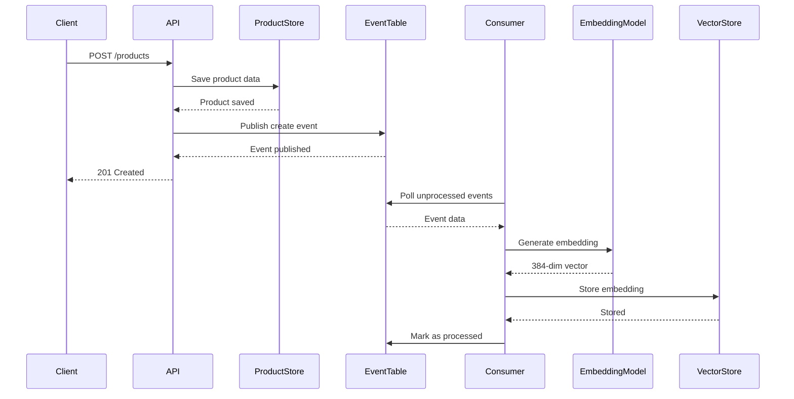
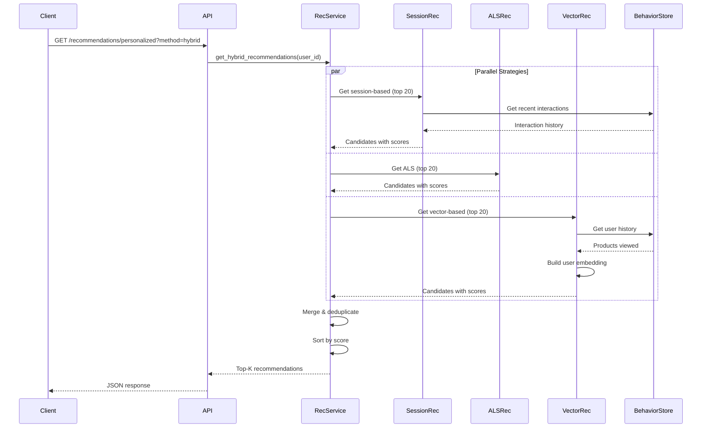
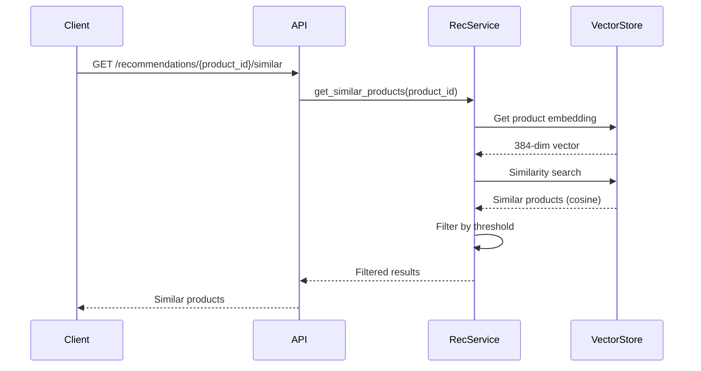
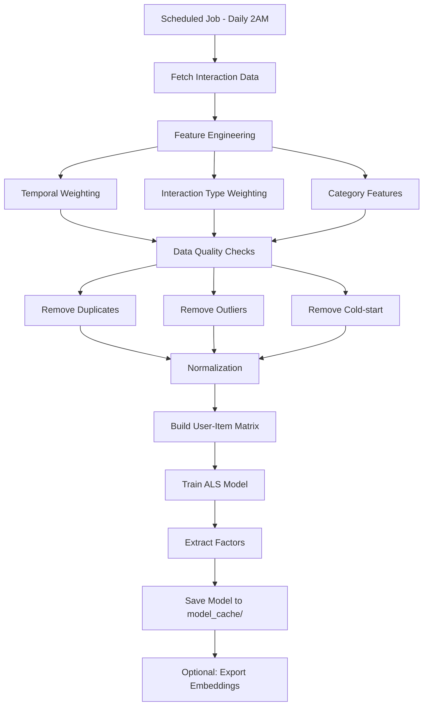

# 📖 Kiến Trúc và Chức Năng Hệ Thống - Realtime AI Recommender

## 📋 Mục Lục

1. [Tổng Quan Hệ Thống](#1-tổng-quan-hệ-thống)
2. [Kiến Trúc Tổng Thể](#2-kiến-trúc-tổng-thể)
3. [Chi Tiết Các Thành Phần](#3-chi-tiết-các-thành-phần)
4. [Luồng Hoạt Động](#4-luồng-hoạt-động)
5. [Phương Pháp Gợi Ý](#5-phương-pháp-gợi-ý)
6. [API Endpoints](#6-api-endpoints)
7. [Cấu Hình Hệ Thống](#7-cấu-hình-hệ-thống)
8. [Deployment và Vận Hành](#8-deployment-và-vận-hành)
9. [Performance và Scalability](#9-performance-và-scalability)

---

## 1. Tổng Quan Hệ Thống

### 1.1. Giới Thiệu

**Realtime AI Recommender** là hệ thống gợi ý sản phẩm theo thời gian thực cho nền tảng thương mại điện tử, sử dụng nhiều phương pháp Machine Learning để đưa ra gợi ý chính xác và phù hợp với nhu cầu người dùng.

### 1.2. Mục Tiêu

- **Real-time Recommendations**: Gợi ý sản phẩm ngay lập tức dựa trên hành vi người dùng
- **Multi-strategy**: Kết hợp nhiều phương pháp ML để tối ưu độ chính xác
- **Scalability**: Có khả năng mở rộng theo quy mô người dùng và sản phẩm
- **Flexibility**: Dễ dàng thay đổi backend thông qua adapter pattern

### 1.3. Các Phương Pháp Recommendation

| Phương pháp       | Mô tả                                         | Use Case                                  |
| ----------------- | --------------------------------------------- | ----------------------------------------- |
| **Vector-based**  | Semantic similarity dựa trên embeddings       | Tìm sản phẩm tương tự, search theo text   |
| **ALS**           | Collaborative filtering với implicit feedback | Gợi ý dựa trên hành vi tập thể người dùng |
| **Session-based** | Dựa trên hành vi gần đây trong phiên          | Gợi ý theo intent hiện tại                |
| **Hybrid**        | Kết hợp nhiều phương pháp                     | Gợi ý cá nhân hóa toàn diện               |

### 1.4. Công Nghệ Sử Dụng

- **API Framework**: FastAPI + Uvicorn
- **ML/AI**: SentenceTransformer (all-MiniLM-L6-v2), ALS (implicit feedback)
- **Vector Store**: Pinecone (384-dimensional embeddings)
- **Database**: Supabase (PostgreSQL)
- **Event Processing**: Supabase (event tables) + Consumer service
- **Infrastructure**: Docker, Docker Compose
- **Language**: Python 3.8+

---

## 2. Kiến Trúc Tổng Thể

### 2.1. Kiến Trúc Layers

Hệ thống tuân theo **Clean Architecture** với 4 layers chính:

```
┌─────────────────────────────────────────────────────────────┐
│                    PRESENTATION LAYER                        │
│  ┌──────────────┐         ┌──────────────┐                │
│  │  FastAPI App │  ────→   │  API Routes   │                │
│  │  (api/app.py)│         │ (recommend.py,│                │
│  │              │         │  products.py) │                │
│  └──────────────┘         └──────────────┘                │
└─────────────────────────────────────────────────────────────┘
                            ↓
┌─────────────────────────────────────────────────────────────┐
│                   APPLICATION LAYER                          │
│  ┌──────────────────────────────────────────────────────┐   │
│  │     RecommendationService (Singleton)                │   │
│  │  - Orchestrates recommendation logic                 │   │
│  │  - Manages ALS model cache                          │   │
│  │  - Coordinates multiple strategies                  │   │
│  └──────────────────────────────────────────────────────┘   │
└─────────────────────────────────────────────────────────────┘
                            ↓
┌─────────────────────────────────────────────────────────────┐
│                      DOMAIN LAYER                            │
│  ┌──────────────┐  ┌──────────────┐  ┌──────────────┐      │
│  │ Recommenders │  │  Embeddings  │  │   Ranking    │      │
│  │ - ALS        │  │ - Product    │  │ - Reranker   │      │
│  │ - Session    │  │ - User       │  │ - Business   │      │
│  │ - Hybrid     │  │ - Similarity │  │   Rules     │      │
│  └──────────────┘  └──────────────┘  └──────────────┘      │
└─────────────────────────────────────────────────────────────┘
                            ↓
┌─────────────────────────────────────────────────────────────┐
│                  INFRASTRUCTURE LAYER                        │
│  ┌──────────────┐  ┌──────────────┐  ┌──────────────┐      │
│  │ Vector Store │  │   Database   │  │   Factory    │      │
│  │ - Pinecone   │  │ - PostgreSQL │  │ - Adapters   │      │
│  │ - Redis      │  │ - Supabase   │  │ - DI         │      │
│  └──────────────┘  └──────────────┘  └──────────────┘      │
└─────────────────────────────────────────────────────────────┘
```

### 2.2. Cấu Trúc Thư Mục

```
realtime-ai-recommender/
├── api/                        # Presentation Layer
│   ├── app.py                  # FastAPI entry point
│   ├── routes/
│   │   ├── recommend.py        # Recommendation endpoints
│   │   └── modern_products.py  # Product management
│   └── middleware/
│       └── logging.py          # Request logging
│
├── services/                   # Application Layer
│   ├── recommendation_service.py      # Main service
│   ├── embedding_service.py           # Embedding generation
│   ├── interaction_service.py         # User interaction tracking
│   └── modern_stream_consumer.py      # Event consumer
│
├── domain/                     # CORE business logic
│   ├── recommenders/
│   │   ├── als_recommender.py          # ALS collaborative filtering
│   │   ├── session_recommender.py      # Session-based
│   │   └── hybrid_recommender.py       # Hybrid strategy
│   ├── embeddings/
│   │   ├── product_embeddings.py       # Product embedding
│   │   ├── user_vector_builder.py      # User embedding
│   │   └── similarity.py               # Similarity calculations
│   └── ranking/
│       ├── reranker.py                 # Re-ranking logic
│       └── business_rules.py           # Business filters
│
├── adapters/                   # Infrastructure
│   ├── vector_store/
│   │   ├── interfaces.py              # Abstract interface
│   │   └── pinecone_adapter.py        # Pinecone implementation
│   ├── database/
│   │   └── supabase_adapter.py        # Supabase implementation
│   ├── messaging/
│   │   └── event_processor.py         # Event processing
│   └── factory.py                     # Adapter factory
│
├── offline/                    # Offline ML pipeline
│   ├── als/
│   │   ├── interaction_features.py    # Feature engineering
│   │   ├── train_als.py               # ALS training
│   │   └── export_embeddings.py       # Embedding export
│   └── evaluation/
│       └── offline_metrics.py         # Metrics calculation
│
├── consumers/                  # Event-driven entrypoint
│   └── modern_product_event_consumer.py
│
├── utils/                      # Utilities
│   ├── normalization.py
│   ├── data_quality.py
│   ├── logging.py
│   └── ab_testing.py
│
├── model_cache/                # Trained models
├── data/                       # Data schemas
├── tests/                      # Unit tests
└── config.py                   # Configuration
```

### 2.3. Design Patterns

| Pattern            | Áp dụng                               | Lợi ích                                   |
| ------------------ | ------------------------------------- | ----------------------------------------- |
| **Singleton**      | Services (VectorStore, EventProducer) | Resource efficiency, shared state         |
| **Adapter**        | Infrastructure adapters               | Backend flexibility, easy testing         |
| **Factory**        | Adapter creation                      | Dependency injection, configuration-based |
| **Strategy**       | Multiple recommenders                 | Pluggable algorithms                      |
| **Consumer Group** | Event processing                      | Load balancing, fault tolerance           |

---

## 3. Chi Tiết Các Thành Phần

### 3.1. Presentation Layer (API)

#### 3.1.1. FastAPI Application (`api/app.py`)

**Chức năng**:

- Khởi tạo FastAPI application
- Mount routes và middleware
- Health check endpoint
- CORS configuration

**Khởi động**:

```python
app = FastAPI(title="Realtime AI Recommender")
app.include_router(recommend_router)
app.include_router(products_router)

@app.get("/health")
async def health():
    return {"status": "healthy"}
```

#### 3.1.2. Recommendation Routes (`api/routes/recommend.py`)

**Endpoints chính**:

- `GET /recommendations/{product_id}/similar`: Sản phẩm tương tự
- `GET /recommendations/personalized`: Gợi ý cá nhân hóa
- `GET /recommendations/search`: Tìm kiếm theo text
- `POST /recommendations/track-view`: Track hành vi xem
- `GET /recommendations/category/{category}`: Gợi ý theo danh mục

#### 3.1.3. Product Routes (`api/routes/modern_products.py`)

**Endpoints chính**:

- `POST /products`: Tạo sản phẩm mới
- `PUT /products/{product_id}`: Cập nhật sản phẩm
- `DELETE /products/{product_id}`: Xóa sản phẩm
- `GET /products/{product_id}`: Lấy thông tin sản phẩm
- `GET /products/similar/{product_id}`: Tìm sản phẩm tương tự
- `GET /products/search/text`: Tìm kiếm theo text

### 3.2. Application Layer (Services)

#### 3.2.1. RecommendationService (`services/recommendation_service.py`)

**Pattern**: Singleton

**Chức năng**:

- Orchestrate các phương pháp recommendation
- Quản lý ALS model cache
- Merge và deduplicate kết quả

**Core Methods**:

```python
class RecommendationService:
    def get_hybrid_recommendations(user_id, limit=10):
        """Kết hợp session + ALS + vector"""

    def get_similar_products(product_id, limit=6):
        """Vector similarity search"""

    def get_similar_products_by_text(query, limit=10):
        """Semantic search"""
```

#### 3.2.2. Event Consumer (`services/modern_stream_consumer.py`)

**Pattern**: Consumer Group + Event Handler

**Chức năng**:

- Poll events từ `product_events` table
- Generate embeddings cho sản phẩm
- Upsert vectors vào Pinecone
- Mark events as processed

**Workflow**:

```
1. Poll unprocessed events
2. Parse event data
3. Generate embedding (384-dim)
4. Store in vector store
5. Mark as processed
```

### 3.3. Domain Layer (Core Logic)

#### 3.3.1. ALS Recommender (`domain/recommenders/als_recommender.py`)

**Algorithm**: Alternating Least Squares (Collaborative Filtering)

**Hyperparameters**:

- Factors: 64
- Iterations: 15
- Regularization: 0.1
- Alpha: 40.0

**Process**:

1. Build user-item interaction matrix (sparse CSR)
2. Train ALS model using implicit library
3. Extract user/item latent factors
4. Prediction: `score = user_factors @ item_factors.T`

**Caching**:

- Model cached in memory
- TTL: Configurable via `ALS_REFRESH_SECONDS`
- Saved to: `model_cache/als_model.npz`

#### 3.3.2. Session Recommender (`domain/recommenders/session_recommender.py`)

**Algorithm**: Item-to-item transition statistics

**Process**:

1. Lấy K interactions gần nhất của user
2. Tính transition probabilities: P(item_B | item_A)
3. Apply scoring:
   - Transition probability
   - Time decay (recent weighted higher)
   - Diversity penalty
   - Popularity normalization
4. Return top candidates

**Configuration**:

- `SESSION_GAP_SECONDS`: Thời gian tách phiên
- `recent_k`: Số interactions gần đây để xét

#### 3.3.3. Product Embeddings (`domain/embeddings/product_embeddings.py`)

**Model**: SentenceTransformer `all-MiniLM-L6-v2`

**Process**:

1. Combine text: `name + description + category + attributes`
2. Generate 384-dim vector
3. Normalize: `embedding / ||embedding||`

**Use cases**:

- Product similarity search
- Semantic text search
- User profile building

### 3.4. Infrastructure Layer (Adapters)

#### 3.4.1. Pinecone Vector Store (`adapters/vector_store/pinecone_adapter.py`)

**Implementation**: `VectorStoreInterface`

**Features**:

- Store 384-dim product embeddings
- Cosine similarity search
- Metadata filtering (category, price)

**Key Methods**:

```python
class PineconeVectorStore:
    def store_product_embedding(product_id, embedding, metadata)
    def find_similar_products(embedding, limit, threshold)
    def get_product_embedding(product_id)
    def delete_product_embedding(product_id)
```

**Performance**:

- Storage: ~1.5KB per product
- Search latency: 10-50ms (10K products)
- Index type: Approximate nearest neighbor

#### 3.4.2. Supabase Adapters (`adapters/database/supabase_adapter.py`)

**3 Adapters**:

1. **SupabaseEventProcessor**:

   - Publish/consume product events
   - Event types: create, update, delete

2. **SupabaseProductStore**:

   - CRUD operations on products table
   - Product listing and filtering

3. **SupabaseUserBehavior**:
   - Track user views
   - Get user interaction history
   - Get popular products by category

**Database Schema**:

```sql
-- Products
CREATE TABLE products (
  id BIGSERIAL PRIMARY KEY,
  product_id TEXT UNIQUE NOT NULL,
  name TEXT,
  description TEXT,
  category TEXT,
  price NUMERIC,
  metadata JSONB,
  created_at TIMESTAMPTZ DEFAULT NOW(),
  updated_at TIMESTAMPTZ DEFAULT NOW()
);

-- Product Events
CREATE TABLE product_events (
  id BIGSERIAL PRIMARY KEY,
  event_type TEXT NOT NULL,  -- create|update|delete
  product_id TEXT NOT NULL,
  data TEXT NOT NULL,        -- JSON string
  timestamp TIMESTAMPTZ DEFAULT NOW(),
  processed BOOLEAN DEFAULT FALSE,
  processed_at TIMESTAMPTZ
);

-- User Views (Behavior Tracking)
CREATE TABLE user_views (
  id BIGSERIAL PRIMARY KEY,
  user_id TEXT NOT NULL,
  product_id TEXT NOT NULL,
  timestamp TIMESTAMPTZ DEFAULT NOW()
);

-- Category Popularity
CREATE TABLE category_popularity (
  category TEXT PRIMARY KEY,
  view_count BIGINT DEFAULT 0,
  last_updated TIMESTAMPTZ DEFAULT NOW()
);
```

#### 3.4.3. Factory Pattern (`adapters/factory.py`)

**Chức năng**: Tạo adapters dựa trên configuration

```python
def get_vector_store() -> VectorStoreInterface:
    if VECTOR_STORE_TYPE == "pinecone":
        return PineconeVectorStore()
    elif VECTOR_STORE_TYPE == "redis":
        return RedisVectorStore()

def get_event_processor() -> EventProcessorInterface:
    if EVENT_PROCESSOR_TYPE == "supabase":
        return SupabaseEventProcessor()
```

**Lợi ích**:

- Dễ switch backends bằng config
- Testable với mock adapters
- Loosely coupled architecture

---

## 4. Luồng Hoạt Động

### 4.1. Product Creation Flow (Real-time Event Processing)



**Chi tiết**:

1. Client gọi `POST /products` với product data
2. API lưu vào `products` table
3. API tạo event trong `product_events` table
4. Consumer (background process) poll events chưa xử lý
5. Generate embedding từ product text
6. Store embedding vào Pinecone
7. Mark event as `processed=true`

### 4.2. Recommendation Flow (Personalized Hybrid)



**Chi tiết**:

1. Client gửi request với `user_id` header
2. Service chạy song song 3 strategies:
   - **Session**: Dựa trên recent K interactions
   - **ALS**: Matrix factorization scores
   - **Vector**: Weighted user embedding similarity
3. Merge candidates, keep best score per product
4. Sort và return top-K

### 4.3. Similar Product Search Flow



**Chi tiết**:

1. Lấy embedding của product gốc
2. Vector similarity search trong Pinecone
3. Filter theo threshold (mặc định 0.75)
4. Return top-K most similar

### 4.4. Offline ALS Training Flow



**Chi tiết**:

1. **Data Collection**: Aggregate user-product interaction counts
2. **Feature Engineering**:
   - Temporal decay: Recent weighted higher
   - Interaction weights: purchase(5x) > cart(3x) > click(2x) > view(1x)
   - Category features
3. **Data Quality**: Remove duplicates, outliers, stale data, cold-start
4. **Normalization**: Apply log/minmax/zscore/sqrt
5. **Training**: AlternatingLeastSquares with 64 factors
6. **Save**: Model cached for real-time inference

---

## 5. Phương Pháp Gợi Ý

### 5.1. Vector-based Recommendations

**Nguyên lý**: Semantic similarity sử dụng embeddings

**Ưu điểm**:

- ✅ Hiểu semantic meaning
- ✅ Không cần training
- ✅ Real-time updates
- ✅ Cold-start cho products mới

**Nhược điểm**:

- ❌ Phụ thuộc chất lượng embeddings
- ❌ Không capture collaborative signals

**Use cases**:

- Tìm sản phẩm tương tự
- Search theo text query
- Gợi ý cho new products

### 5.2. ALS (Collaborative Filtering)

**Nguyên lý**: Matrix factorization với implicit feedback

**Ưu điểm**:

- ✅ Capture collaborative patterns
- ✅ Discover latent preferences
- ✅ Scalable với large datasets

**Nhược điểm**:

- ❌ Cần training time
- ❌ Cold-start cho new users/items
- ❌ Không real-time

**Use cases**:

- Personalized recommendations
- "Users who viewed X also viewed Y"
- Long-term preference modeling

**Training Details**:

- Frequency: Daily at 2AM
- Algorithm: AlternatingLeastSquares (implicit library)
- Matrix: Sparse CSR (n_users × n_items)
- Factors: 64-dimensional latent vectors

### 5.3. Session-based Recommendations

**Nguyên lý**: Item-to-item transitions dựa trên phiên

**Ưu điểm**:

- ✅ Reflect current intent
- ✅ Không cần training
- ✅ Fast inference
- ✅ Capture short-term patterns

**Nhược điểm**:

- ❌ Phụ thuộc transition statistics
- ❌ Không capture long-term

**Use cases**:

- "Next item" predictions
- Session continuity
- Real-time intent tracking

**Scoring Components**:

- Transition probability: P(next | current)
- Time decay: Recent interactions weighted higher
- Diversity penalty: Avoid repetition
- Popularity normalization: Balance popular vs niche

### 5.4. Hybrid Recommendations

**Nguyên lý**: Ensemble của nhiều strategies

**Process**:

1. Collect candidates từ multiple sources (20 each):
   - Session-based
   - ALS (if available)
   - Vector-based
2. Merge và deduplicate by product_id
3. Keep best score per product
4. Sort by final score
5. Return top-K

**Ưu điểm**:

- ✅ Tận dụng strengths của từng method
- ✅ Robust với missing data
- ✅ Better coverage
- ✅ Balance explore/exploit

**Nhược điểm**:

- ❌ Higher latency (multiple queries)
- ❌ Complex score normalization

---

## 6. API Endpoints

### 6.1. Health Check

```http
GET /health
```

**Response**:

```json
{
  "status": "healthy"
}
```

### 6.2. Products Management

#### Create Product

```http
POST /products
Content-Type: application/json

{
  "id": "p-001",
  "name": "Gaming Laptop",
  "description": "High-performance laptop for gaming",
  "category": "electronics",
  "price": 1299.99,
  "sku": "LAPTOP-001",
  "attributes": {
    "brand": "ASUS",
    "ram": "16GB",
    "storage": "512GB SSD"
  }
}
```

#### Update Product

```http
PUT /products/{product_id}
Content-Type: application/json

{
  "name": "Gaming Laptop Pro",
  "price": 1499.99
}
```

#### Delete Product

```http
DELETE /products/{product_id}
```

#### Get Product

```http
GET /products/{product_id}?include_similar=true
```

#### Search Products

```http
GET /products/search/text?query=gaming laptop&limit=10&category=electronics
```

#### List Products

```http
GET /products?category=electronics&limit=100&offset=0
```

### 6.3. Recommendations

#### Similar Products (Vector)

```http
GET /recommendations/{product_id}/similar?limit=6
Header: user-id: u-123
```

**Response**:

```json
{
  "recommendations": [
    {
      "product_id": "prod-456",
      "score": 0.95,
      "name": "Similar Product",
      "category": "electronics"
    }
  ]
}
```

#### Personalized Recommendations

```http
GET /recommendations/personalized?limit=10&method=hybrid&recent_k=5
Header: user-id: u-123
```

**Methods**: `vector`, `als`, `session`, `hybrid`

#### Search by Text

```http
GET /recommendations/search?query=laptop gaming&limit=10
```

#### Category Popular

```http
GET /recommendations/category/{category}?limit=10
```

#### Track User View

```http
POST /recommendations/track-view?product_id=p-001
Header: user-id: u-123
```

### 6.4. Backend Info

```http
GET /products/backend-info
```

**Response**:

```json
{
  "backend_type": "cloud",
  "vector_store": "pinecone",
  "event_processor": "supabase",
  "data_store": "supabase",
  "behavior_store": "supabase",
  "runtime_status": {
    "server_time": "2024-01-01T00:00:00Z"
  }
}
```

---

## 7. Cấu Hình Hệ Thống

### 7.1. Environment Variables

```bash
# Backend Selection
BACKEND_TYPE=cloud                    # cloud | local
VECTOR_STORE_TYPE=pinecone           # pinecone | redis
EVENT_PROCESSOR_TYPE=supabase        # supabase | postgres
DATA_STORE_TYPE=supabase
BEHAVIOR_STORE_TYPE=supabase

# Pinecone Configuration
PINECONE_API_KEY=your-api-key
PINECONE_ENVIRONMENT=us-east-1
PINECONE_INDEX_NAME=product-recommendations
VECTOR_DIMENSION=384

# Supabase Configuration
SUPABASE_URL=https://your-project.supabase.co
SUPABASE_SERVICE_ROLE_KEY=your-service-key

# API Configuration
API_HOST=0.0.0.0
API_PORT=8000
DEBUG_MODE=false
LOG_LEVEL=INFO

# ALS Configuration
ALS_FACTORS=64
ALS_ITERATIONS=15
ALS_REGULARIZATION=0.1
ALS_ALPHA=40.0
ALS_REFRESH_SECONDS=86400           # 24 hours
ALS_MODEL_PATH=./model_cache/als_model.npz

# Session Configuration
SESSION_GAP_SECONDS=1800             # 30 minutes
SESSION_RECENT_K=10

# Recommendation Configuration
SIMILARITY_THRESHOLD=0.75
DEFAULT_LIMIT=10
```

### 7.2. Configuration Management (`config.py`)

```python
from pydantic import BaseSettings

class Settings(BaseSettings):
    # All environment variables loaded here
    # Type validation
    # Default values

    class Config:
        env_file = ".env"
        case_sensitive = False

settings = Settings()
```

---

## 8. Deployment và Vận Hành

### 8.1. Local Development

**Prerequisites**:

- Python 3.8+
- Pinecone account
- Supabase project

**Setup**:

```bash
# Create virtual environment
python -m venv .venv
.venv\Scripts\activate  # Windows
source .venv/bin/activate  # Linux/Mac

# Install dependencies
pip install -r requirements.txt

# Create .env file (see .env.example)
cp .env.example .env
# Edit .env with your credentials

# Run API server
python -m api.app

# Run event consumer (separate terminal)
python -m services.modern_stream_consumer
```

### 8.2. Docker Deployment

**Docker Compose**:

```yaml
version: "3.8"

services:
  api:
    build: .
    ports:
      - "8000:8000"
    environment:
      - PINECONE_API_KEY=${PINECONE_API_KEY}
      - SUPABASE_URL=${SUPABASE_URL}
      - SUPABASE_SERVICE_ROLE_KEY=${SUPABASE_SERVICE_ROLE_KEY}
    command: python -m api.app

  stream-consumer:
    build: .
    environment:
      - PINECONE_API_KEY=${PINECONE_API_KEY}
      - SUPABASE_URL=${SUPABASE_URL}
      - SUPABASE_SERVICE_ROLE_KEY=${SUPABASE_SERVICE_ROLE_KEY}
    command: python -m services.modern_stream_consumer
```

**Run**:

```bash
# Development
docker-compose -f docker-compose.dev.yml up

# Production
docker-compose up -d
```

### 8.3. Offline Training Schedule

**Cron Job (Linux)**:

```bash
# Daily at 2 AM
0 2 * * * cd /path/to/project && python -m offline.als.train_als
```

**Windows Task Scheduler**:

- Trigger: Daily 2:00 AM
- Action: `python -m offline.als.train_als`
- Start in: Project directory

### 8.4. Monitoring

**Metrics to Track**:

- API response times
- Consumer processing lag
- Vector store query latency
- ALS model refresh status
- Error rates
- Recommendation diversity
- Coverage (% catalog recommended)

**Logging**:

- Structured logging với Loguru
- Log levels: DEBUG, INFO, WARNING, ERROR
- Request/response logging
- Performance timing logs

---

## 9. Performance và Scalability

### 9.1. Performance Characteristics

| Component          | Metric                               | Value                           |
| ------------------ | ------------------------------------ | ------------------------------- |
| **Vector Store**   | Storage per product                  | ~1.5KB                          |
|                    | Search latency (10K products)        | 10-50ms                         |
|                    | Scalability                          | Linear with HNSW                |
| **Event Consumer** | Processing per product               | 10-30ms                         |
|                    | Throughput                           | 50-100 products/sec             |
|                    | Scalability                          | Horizontal (multiple consumers) |
| **ALS Training**   | Training time (10K users × 1K items) | ~2-5 minutes                    |
|                    | Model size                           | ~500KB (64 factors)             |
| **API Endpoints**  | Recommendation latency               | 50-200ms                        |
|                    | Throughput                           | 100+ req/sec                    |

### 9.2. Caching Strategy

**1. ALS Model Cache**:

- Loaded once, cached in memory
- Refreshed when file updated
- Thread-safe with locks

**2. Session Statistics**:

- Cached transition probabilities
- TTL: 5 minutes
- Rebuilt from recent interactions

**3. Vector Store**:

- Pinecone handles internal caching
- Fast retrieval for frequently accessed

**4. User Embeddings**:

- Built on-demand from history
- Can add Redis cache layer

### 9.3. Scalability

**Horizontal Scaling**:

- ✅ API servers: Stateless, can scale out
- ✅ Event consumers: Multiple instances with consumer groups
- ✅ Vector store: Pinecone auto-scales
- ✅ Database: PostgreSQL replication

**Vertical Scaling**:

- Increase consumer batch size
- More powerful embedding model (accuracy vs speed tradeoff)
- Larger ALS factors (quality vs speed)

**Optimization Tips**:

- Batch embedding generation
- Async vector storage
- Connection pooling
- Request deduplication

### 9.4. Data Flow Optimization

```
┌─────────────┐
│   Client    │
└──────┬──────┘
       │
       ├──────────────────────────┐
       │                          │
       ↓                          ↓
┌──────────────┐          ┌──────────────┐
│  API Server  │          │  API Server  │  ← Load Balancer
│  (Instance1) │          │  (Instance2) │
└──────┬───────┘          └──────┬───────┘
       │                          │
       ├──────────────────────────┤
       ↓                          ↓
┌─────────────────────────────────────────┐
│         Pinecone Vector Store           │
│         (Managed, Auto-scale)           │
└─────────────────────────────────────────┘

       ↓
┌─────────────────────────────────────────┐
│     Supabase (PostgreSQL + Events)      │
└──────┬──────────────────────────────────┘
       │
       ├──────────────────────────┐
       │                          │
       ↓                          ↓
┌──────────────┐          ┌──────────────┐
│  Consumer 1  │          │  Consumer 2  │  ← Consumer Group
└──────────────┘          └──────────────┘
```

---

## 10. Tóm Tắt

### 10.1. Điểm Mạnh

✅ **Clean Architecture**: Tách biệt layers, dễ maintain
✅ **Flexible Backends**: Adapter pattern cho multi-backend
✅ **Multi-strategy**: 4 phương pháp recommendation
✅ **Real-time**: Event-driven cho product updates
✅ **Scalable**: Horizontal scaling support
✅ **Production-ready**: Error handling, logging, monitoring

### 10.2. Use Cases Chính

1. **E-commerce Product Recommendations**
2. **Similar Product Discovery**
3. **Personalized Shopping**
4. **Semantic Search**
5. **Session-based "Next Item" Predictions**

### 10.3. Tech Stack Summary

| Layer             | Technology                          |
| ----------------- | ----------------------------------- |
| **API**           | FastAPI, Uvicorn                    |
| **ML/AI**         | SentenceTransformer, ALS (implicit) |
| **Vector DB**     | Pinecone (384-dim)                  |
| **Database**      | Supabase (PostgreSQL)               |
| **Orchestration** | Docker, Docker Compose              |
| **Language**      | Python 3.8+                         |

### 10.4. Roadmap

**Short-term**:

- [ ] Chuẩn hóa popularity ranking
- [ ] Dead letter queue cho failed events
- [ ] Health check endpoints chi tiết
- [ ] Metrics export (Prometheus)

**Mid-term**:

- [ ] A/B testing framework
- [ ] Real-time Supabase subscriptions
- [ ] Distributed tracing (OpenTelemetry)
- [ ] Auto-scaling consumers

**Long-term**:

- [ ] Multi-model ensemble (deep learning)
- [ ] Graph-based recommendations
- [ ] Real-time personalization
- [ ] Advanced feature engineering

---

**Tài liệu này được tạo vào**: 2026-01-11
**Phiên bản**: 1.0
**Tác giả**: AI Documentation Assistant
